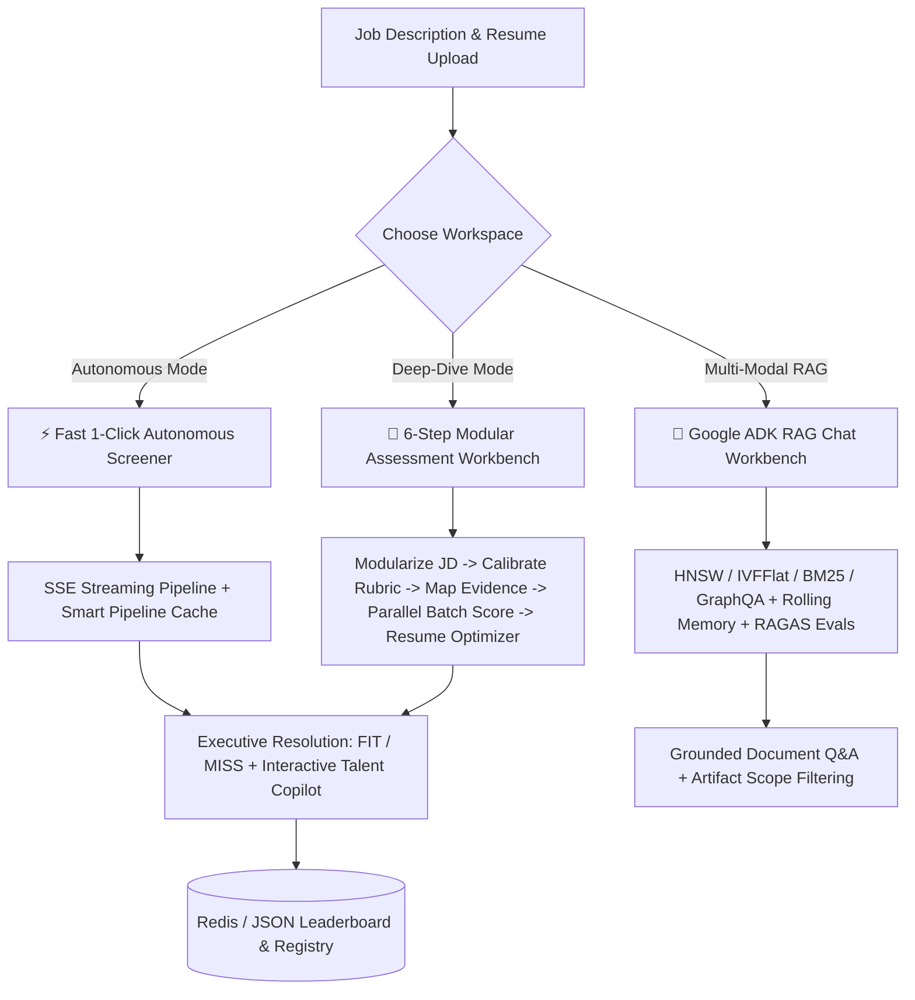

# ◢ Candidate_screener.ai ◣
### Agentic Candidate Assessment & Multi-Modal ADK RAG Workbench // ver. 1.2.0

<p align="center">
  
</p>

<p align="center">
  
  
  
  
  
  
</p>

> [!IMPORTANT]
> **Candidate_screener.ai** is an enterprise-grade, token-efficient candidate assessment engine and multi-modal RAG workbench. Built with a **Neo-Retro Glassmorphic UI**, the platform unites automated multi-agent candidate screening, tailored resume optimization, interactive talent copilots, and a Google Agent Development Kit (ADK) conversational RAG system with multi-strategy retrieval and real-time Gemini pricing telemetry.

---

## 🌟 Key Highlights & Feature Matrix



---

## ⚙️ Core Diagnostics & Features

### ⚡ 1. Autonomous Screening Copilot & Live Streaming Pipeline
* **`1-Click Autonomous Assessment`**: Upload a candidate resume (PDF/DOCX/TXT) and select a target Job Description to trigger an end-to-end evaluation pipeline in seconds.
* **`Real-Time SSE Streaming`**: Live Server-Sent Events stream step-by-step agent execution (`/api/agent/autonomous_screen/stream`) with real-time visual progress logs and sub-task status.
* **`Zero-Token Pipeline Cache`**: Hashes and caches JD competency vertical extractions, compiled scoring rubrics, and resume evidence mappings in Redis / disk to eliminate redundant LLM calls on repeated evaluations (0 tokens consumed on cache hits).
* **`Executive Resolution Synthesis`**: Programmatically computes weighted competency scores with strict edge-case validation and critical failure guards to deliver definitive **`FIT`** or **`MISS`** resolutions with 2-sentence executive justifications.
* **`Context-Aware Talent Copilot`**: Embedded conversational recruiter copilot with contextual memory of the candidate's parsed resume history, tenure, and scorecards for follow-up inquiries.

### 🔬 2. Deep-Dive 6-Step Modular Assessment Workbench
* **`Step 1: JD Modularizer`**: Extracts 3 to 6 distinct competency verticals (e.g., Core Architecture, Technical Execution, Governance, Leadership) from raw JD text.
* **`Step 2: Calibrated Weighting & Rubric Compilation`**: Assign customizable priority weights (`High`, `Medium`, `Low`, `Ignore`) per vertical and compile calibrated 0–10 evidence-based grading rubrics.
* **`Step 3: Multi-Format Resume Parser & Evidence Mapping`**: Ingests PDF/DOCX files, sanitizes text, and extracts verbatim quotes mapped to each competency vertical.
* **`Step 4: Parallel Batch Dimension Evaluation`**: Executes multi-axis agent scoring in a single batch request, providing 0–10 scores, detailed rationales, demonstrated strengths (green points), and miss points (gaps).
* **`Step 5: Interactive Scorecard Stack`**: Visual competency breakdown with expandable cards, progress meters, and phase-level token analytics.
* **`Step 6: AI Resume Optimizer & Gap Bridging`**: Generates a polished, upgraded Markdown resume tailored to the target JD that emphasizes transferable skills to bridge discovered candidate gaps while preserving verified factual work history.

### 🤖 3. Google ADK Multi-Modal RAG Chat Workbench
* **`Multi-Turn ADK Agent Interface`**: Conversational agent powered by the `google-genai` SDK and Google ADK RAG design patterns.
* **`Multi-Strategy Hybrid Retrieval Backends`**:
  * **HNSW Vector Search**: High-dimensional cosine similarity embeddings for deep semantic matching.
  * **IVFFlat Sub-Space Search**: Fast inverted file index with centroid partitioning for large-scale document chunks.
  * **BM25 Lexical Search**: Keyword-focused Rank-BM25 scoring for exact keyword and terminology recall.
  * **GraphQA Knowledge Graph**: NetworkX entity-relation graph traversal for multi-hop relational discovery.
* **`Rolling Context Memory Compression`**: Condenses conversation history into a rolling 2-sentence executive memory summary after 3+ turns, preventing context length explosion while retaining key conversational context.
* **`Ingested Artifact Directory & Scope Filtering`**: Visual card grid of uploaded artifacts showing chunk breakdowns (`text`, `diagram`, `table`), character volume, and single-click deletion. Allows RAG queries to be scoped globally or restricted to a specific artifact (`📄 candidate_spec.pdf`).
* **`RAGAS & Code-Driven Evals`**: Computes automated benchmarks including Faithfulness, Answer Relevance, Context Precision/Recall, Hit Rate @ K, MRR, and Latency.
* **`Multi-Session Persistence`**: Manage, switch between, and persist multiple RAG chat sessions to disk (`rag_sessions.json`).

### 💰 4. Token Telemetry & Real-Time Gemini Pricing
* **`Per-Message & Phase Telemetry`**: Live tracking of `input_tokens` and `output_tokens` across every LLM interaction, streaming phase, and evaluation step.
* **`Live Google Gemini USD Cost Calculator`**: Automatically calculates estimated USD cost using official Google Gemini rates:
  * **Gemini 2.5 Flash / 1.5 Flash**: $0.075 / 1M input tokens, $0.30 / 1M output tokens.
  * **Gemini 2.5 Pro / 1.5 Pro**: $1.25 / 1M input tokens, $5.00 / 1M output tokens.
* **`Cumulative Session Banner`**: Persistent counter tracking total tokens and accumulated session expenditure in real time.

### 🔍 5. Dynamic API Key Model Discovery
* **`Auto-Discovery Endpoint`**: Discovers all supported Gemini and GCP Vertex models for the active API key via `POST /api/models/list` (`client.models.list()`).
* **`Dynamic Model Switcher`**: Automatically populates UI dropdowns with verified available models for standard API keys and GCP service accounts.

### 🏆 6. Leaderboard Registry & Job Description Library
* **`Candidate Leaderboard`**: Ranked registry of evaluated candidates with score sorting, verdict badges, and detailed evaluation review modals.
* **`JD Library`**: Auto-saves and organizes reusable Job Descriptions and extracted verticals for recurring hiring workflows.
* **`Dual-Layer Persistence`**: Built with Redis backend caching and zero-dependency local JSON file fallbacks (`jds.json`, `candidates.json`, `resumes.json`, `pipeline_cache.json`, `rag_sessions.json`).

### 🎨 7. Unified Neo-Retro Glassmorphic Design System
* **`Minimalist Interactive Landing Page`**: High-impact portal highlighting core capabilities, architecture workflow steps, live metrics, and 1-click launch shortcuts into all 3 workspaces.
* **`Triple-Theme Engine`**: Cyber Dark (default), Clean Light, and Neo-Retro Cyberpunk themes.
* **`Fluid Animations & Progress Telemetry`**: Micro-animations, responsive glassmorphic cards, custom scrollbars, and branded header navigation.

---

## 🛠️ Technology Stack

| Layer | Technology | Role & Capability |
|---|---|---|
| **Frontend UI** | **React 19 + Vite 8** | Neo-retro glassmorphic styling, Lucide icons, responsive drawer navigation, real-time SSE streaming listeners. |
| **Backend API** | **FastAPI + Uvicorn** | Asynchronous Python REST and SSE streaming server. |
| **LLM & Agent Engine** | **Google GenAI SDK + ADK Patterns** | Native Gemini 2.5/1.5 Flash & Pro orchestration, structured JSON outputs, rolling context compression. |
| **Search Strategies** | **HNSW / IVFFlat / BM25 / GraphQA** | Hybrid vector embedding search, IVFFlat centroids, Rank-BM25 lexical scoring, and NetworkX Knowledge Graph. |
| **Evaluation Framework** | **RAGAS + Code-Driven Benchmarks** | Faithfulness, Answer Relevance, Context Precision, Hit Rate @ K, MRR, and Latency tracking. |
| **Storage & Persistence** | **Redis + Local JSON Fallback** | Scalable Redis caching with seamless local JSON fallback for zero-dependency local setups. |
| **Document Parsers** | **PyPDF + Python-Docx** | Multi-modal text, table, and diagram parsing and chunk sanitization. |
| **Containerization** | **Docker + Docker Compose** | Production-ready multi-stage Docker builds with Nginx reverse proxy. |

---

## 🚀 Boot Sequence & Installation

### 1. Prerequisites
* **Python 3.10+**
* **Node.js 18+** and **npm**
* **Docker & Docker Compose** (optional, for containerized execution)
* **Google Gemini API Key** (obtain from [Google AI Studio](https://aistudio.google.com/))

---

### Option A: Local Development Setup

#### 1. Backend Boot Sequence
```bash
# 1. Navigate to backend directory
cd backend

# 2. Create and activate a Python virtual environment
python -m venv ../venv
# On Windows PowerShell:
..\venv\Scripts\Activate.ps1
# On Linux/macOS:
source ../venv/bin/activate

# 3. Install dependencies
pip install -r requirements.txt

# 4. Start the FastAPI development server (Port 8000)
python -m uvicorn main:app --host 127.0.0.1 --port 8000 --reload
```

#### 2. Frontend Boot Sequence
```bash
# 1. Open a new terminal and navigate to frontend directory
cd frontend

# 2. Install Node dependencies
npm install

# 3. Launch Vite development server (Port 5173)
npm run dev
```

Visit **`http://localhost:5173`** in your browser.

---

### Option B: Docker Compose Deployment

Run the entire application (Frontend + Backend + Volume Persistence) with a single command:

```bash
# Set your Gemini API Key (optional via env or configure via UI)
export GEMINI_API_KEY="your_api_key_here"

# Build and start all containers
docker-compose up --build
```

* **Frontend UI**: `http://localhost` (Port 80)
* **Backend API**: `http://localhost:8000` (Port 8000)
* **API Documentation**: `http://localhost:8000/docs`

---

## 📡 API Endpoints Directory

### ⚡ Autonomous Screener & Talent Copilot
| Method | Endpoint | Description |
|---|---|---|
| `POST` | `/api/agent/autonomous_screen` | Execute full 5-stage synchronous assessment. |
| `POST` | `/api/agent/autonomous_screen/stream` | Stream live 5-stage assessment with Server-Sent Events (SSE). |
| `POST` | `/api/chat` | Context-aware AI Talent Advisor conversational assistant. |
| `POST` | `/api/chat/stream` | Stream responses from AI Talent Advisor. |

### 🔬 Candidate Assessment & Modular Pipeline
| Method | Endpoint | Description |
|---|---|---|
| `POST` | `/api/jd/modularize` | Extract 3–6 competency verticals from Job Description text. |
| `POST` | `/api/rubric/compile` | Compile 0–10 evidence scoring rubric with calibrated weights. |
| `POST` | `/api/resume/parse` | Parse raw text from uploaded PDF / DOCX resume files. |
| `POST` | `/api/resume/map` | Semantic extraction mapping resume quotes to JD verticals. |
| `POST` | `/api/agent/evaluate` | Single-vertical candidate evaluation. |
| `POST` | `/api/agent/evaluate_batch` | Parallel multi-axis batch candidate evaluation. |
| `POST` | `/api/agent/synthesize` | Synthesize final resolution verdict (`FIT` vs `MISS`). |
| `POST` | `/api/resume/optimize` | Generate upgraded Markdown resume tailored to JD & bridging gaps. |

### 🤖 Google ADK Multi-Modal RAG Workbench
| Method | Endpoint | Description |
|---|---|---|
| `POST` | `/api/rag/upload` | Ingest multi-modal document (PDF/DOCX/TXT) into RAG indexes. |
| `POST` | `/api/rag/query` | Execute retrieval + optional agentic flow & RAGAS evaluations. |
| `POST` | `/api/rag/chat` | Multi-turn ADK RAG chat with active session memory & artifact filtering. |
| `GET` | `/api/rag/sessions` | List all active RAG chat sessions. |
| `POST` | `/api/rag/sessions/new` | Initialize a new RAG chat session. |
| `GET` | `/api/rag/sessions/{session_id}/history` | Retrieve complete message history and memory state. |
| `DELETE` | `/api/rag/sessions/{session_id}` | Delete a RAG chat session. |
| `GET` | `/api/rag/artifacts` | Get summary of ingested document artifacts and chunk distributions. |
| `DELETE` | `/api/rag/artifacts/{doc_name}` | Delete specific artifact from RAG vector & graph index. |
| `GET` | `/api/rag/stats` | Get chunk counts, graph nodes, and strategy availability. |

### 🏆 Leaderboard, JD Library & Resume Cache
| Method | Endpoint | Description |
|---|---|---|
| `GET` | `/api/candidates` | Fetch ranked candidate registry (filterable by `jd_id`). |
| `POST` | `/api/candidates` | Save candidate evaluation score and summary to registry. |
| `DELETE` | `/api/candidates/{id}` | Remove candidate record from registry. |
| `GET` | `/api/jds` | Fetch saved Job Description library. |
| `POST` | `/api/jds` | Save Job Description and extracted verticals. |
| `DELETE` | `/api/jds/{id}` | Delete Job Description from library. |
| `POST` | `/api/jds/clear` | Clear all saved Job Descriptions. |
| `GET` | `/api/resumes` | List cached candidate resumes. |
| `GET` | `/api/resumes/cache` | Retrieve cached resume text and pre-computed mappings. |
| `POST` | `/api/resumes/cache` | Store resume text and pre-computed mappings. |
| `POST` | `/api/resumes/clear` | Clear resume cache. |

### 🔍 System & Model Discovery
| Method | Endpoint | Description |
|---|---|---|
| `GET` | `/api/health` | Health check endpoint. |
| `POST` | `/api/config/test` | Validate Gemini / Vertex API key connection. |
| `POST` | `/api/models/list` | Dynamically discover supported models for the supplied API key. |

---

## 🔒 Configuration & Environment Variables

Configure your environment using the UI `[CONFIG]` control panel in the top header or via backend environment variables:

| Variable | Default | Description |
|---|---|---|
| `GEMINI_API_KEY` | `""` | Google Gemini API Key for LLM and ADK RAG calls. |
| `REDIS_URL` | `redis://127.0.0.1:6379` | Redis connection URL (falls back to local JSON files if unavailable). |
| `VITE_API_URL` | `http://127.0.0.1:8000` | Backend API base URL for Frontend proxy. |

---

## 📄 License
This project is licensed under the [MIT License](file:///e:/PythonProject/screen-assistant-ai/LICENSE).
